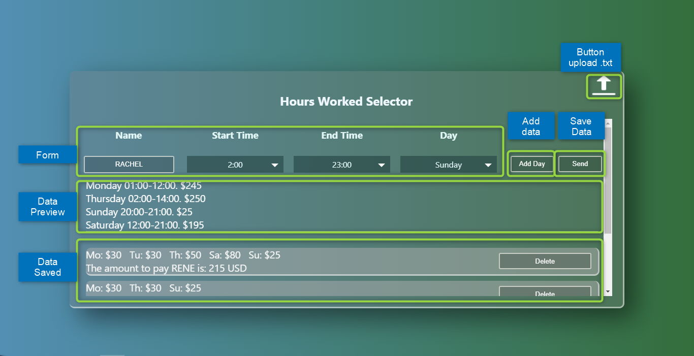

# Getting Started with Create React App

## Available Scripts

In the project directory, run this scripts for start the App :

1. Clone the project:
   `CLONE`

```terminal
git clone https://github.com/geovannyC/ioet-technical-test.git
```

2. Install dependences:
   `INSTALL`

```terminal
...npm install
```

3. Launch the project:
   `START`

```terminal
...npm start
```

Runs the app in the development mode.\
Open [http://localhost:3000](http://localhost:3000) to view it in your browser.

3. Launcher the test runner:
   `TEST`

```terminal
...npm test
```

<details><summary>Architecture</summary>

```
IOET
├── README.md
├── package-lock.json
├── package.json
├── src
│    ├── addons
│    │   └── file.txt
│    │   └── upload.png
│    ├── components
│    │      ├── content-card.js
│    │      │   ├── contentCard.jsx
│    │      │   ├── customSelect.jsx
│    │      │   ├── data-time.js
│    │      │   ├── modules.js
│    │      │   └── style.css
│    │      └── home.js
│    │          ├── home.jsx
│    │          └── home.css
│    ├── context
│    │      ├── context.js
│    │      ├── data-reducer.js
│    │      ├── GolbalState.js
│    │      └── identifiers.js
│    ├── test
│    │       ├── App.test.js
│    │       └── readfile.js
│    ├── index.css
│    └── index.js
└── example-files
     ├── file.txt
     ├── file1.txt
     ├── file2.txt
     ├── file3.txt
     ├── file4.txt
     └── file5.txt
```

</details>
     
<div align="center">
	<h1 >Intewview App</h1>
		
</div>
<div align="center">
	<h2 >Selector Component</h2>
		
</div>
<div align="center">
	<h2 >Data Preview</h2>
		
</div>
<div align="center">
	<h2 >Data Saved</h2>
		
</div>
<div align="center">
	<h2 >File Selector Component</h2>
		
</div>
<div align="center">
	<h2 >Auto Generator Data Preview</h2>
		
</div>
<div align="center">
	<h2 >Data Saved from .txt file</h2>
		
</div>
<div align="center">
	<h2 >Test</h2>
		
</div>
